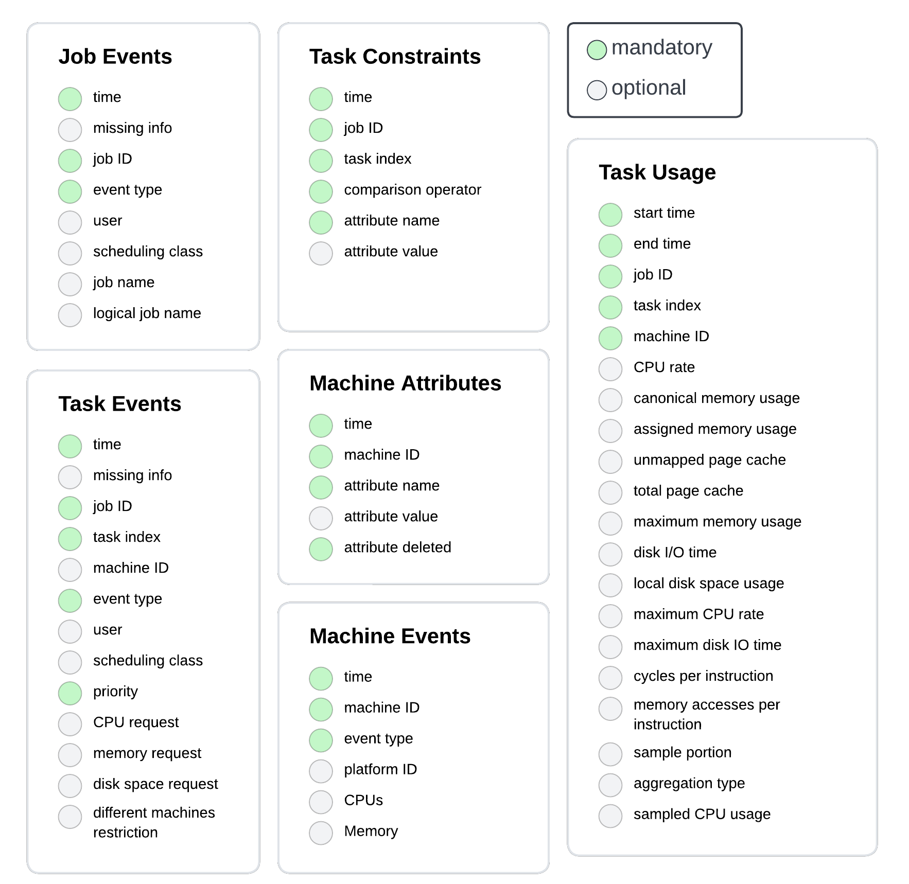
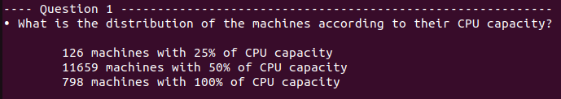
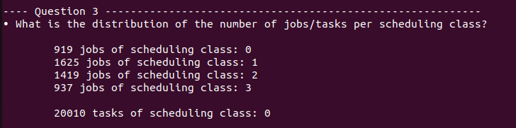
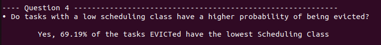
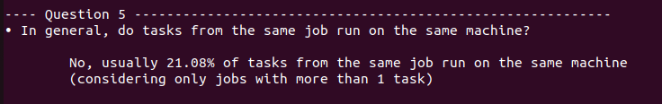
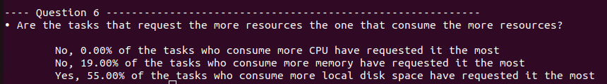

# Name of the participants
Name: Guilherme Akira ALVES DOS SANTOS

# Introduction

It is a Google Cluster Data Analysis using Apache Spark.
Project developed for the Large-Scale Data Management and Distributed Systems course at Grenoble INP : M2 MoSIG.

> 📄[Project Specification](https://tropars.github.io/downloads/lectures/LSDM/LSDM-lab-spark-google.pdf) 📊[Dataset Documentation](https://github.com/google/cluster-data/blob/master/ClusterData2011_2.md)

## Dataset Schema



# Usage

## Cloning the repo

```
git clone git@github.com:gAkira/LSDM-Spark.git
cd LSDM-Spark
```

## Download a sample of the dataset

```
bash download_data_sample.sh
```

## Run the Spark analysis

```
python3 navigation.py
```

# Description of the analyses conducted

After running the script navigation.py, you will be shown each proposed
question, along with its respective result. The implementation is well
commented in the file navigation.py.
Seven questions were proposed along of the [project specification](https://tropars.github.io/downloads/lectures/LSDM/LSDM-lab-spark-google.pdf):

## Question 1

> What is the distribution of the machines according to their CPU capacity?

For this question we filter out the CPU values which are set to null from
machine events, then we create a list of tuples (machineID, CPU capacity),
group them by key (machineID), selecting its minimum capacity. At the end we
count its number of occurences and show its results.



## Question 2

> What is the percentage of computational power lost due to maintenance (a machine went
offline and reconnected later)?

Couldn't find a solution.

## Question 3

> What is the distribution of the number of jobs/tasks per scheduling class?

We select from job events the tuple (jobID, jobSchedulingClass), then group by key
(jobID). Count the number of job occurences with reduceByKey, then show them.

For the tasks its similar:
We select from task events the tuple (taskID, taskSchedulingClass), then group by key
(taskID). Count the number of task occurences with reduceByKey, then show them.



## Question 4

> Do tasks with a low scheduling class have a higher probability of being evicted?

Firstly we select tuples (job, task) with low scheduling class (, then we filter
only the tuples (job, task) that were evicted (event type := 2).
We analyse how much is the size of the intersection between the tasks with the
lowest schedulling class and the tasks EVICTed.



## Question 5

> In general, do tasks from the same job run on the same machine?

We build tuples from task usage in the form (job, set(task, machine)) grouped by jobs.
Calculate the percentage of mode (most occurrences of machineID) over the
entire set for each job that have already scheduled at least 2 tasks (> 1)
Then print the results.



## Question 6

> Are the tasks that request the more resources the one that consume the more resources?

Select tuples from task events in the form (job, task) querying for the ones
that request more CPU, then select tuples from task usage also in the form
(job, task) querying for the ones that consume more resources (in this case,
CPU). Calculate the intersection between them and print its results.

It is done the same for the memory and disk space usage.



## Question 7

> Can we observe correlations between peaks of high resource consumption on some ma-
chines and task eviction events?

Tried some approaches, but still couldn't find a solution.
